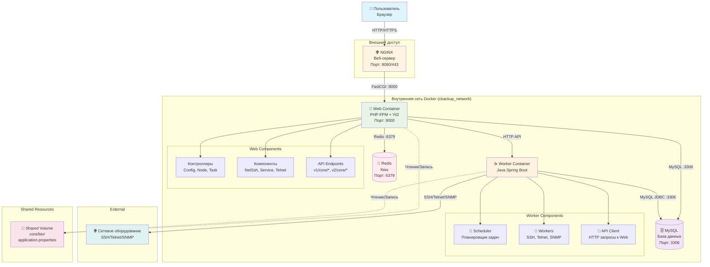
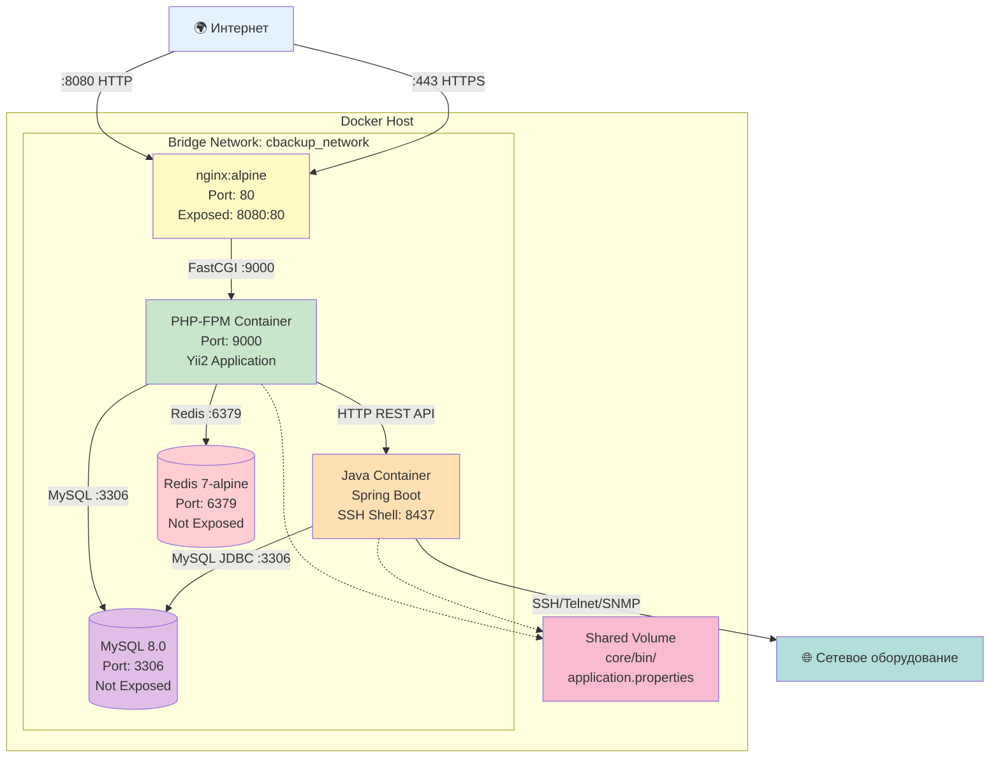
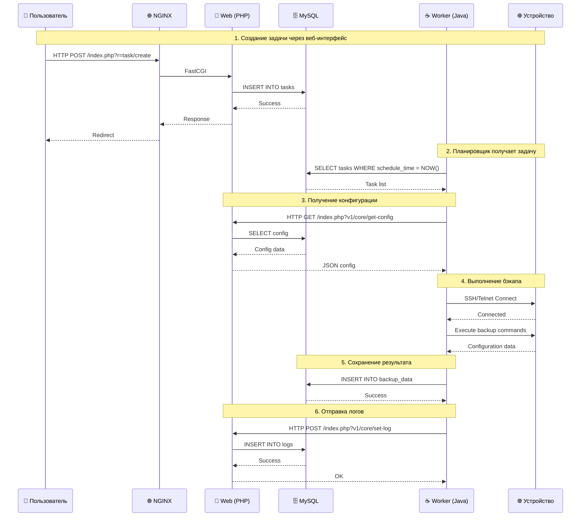
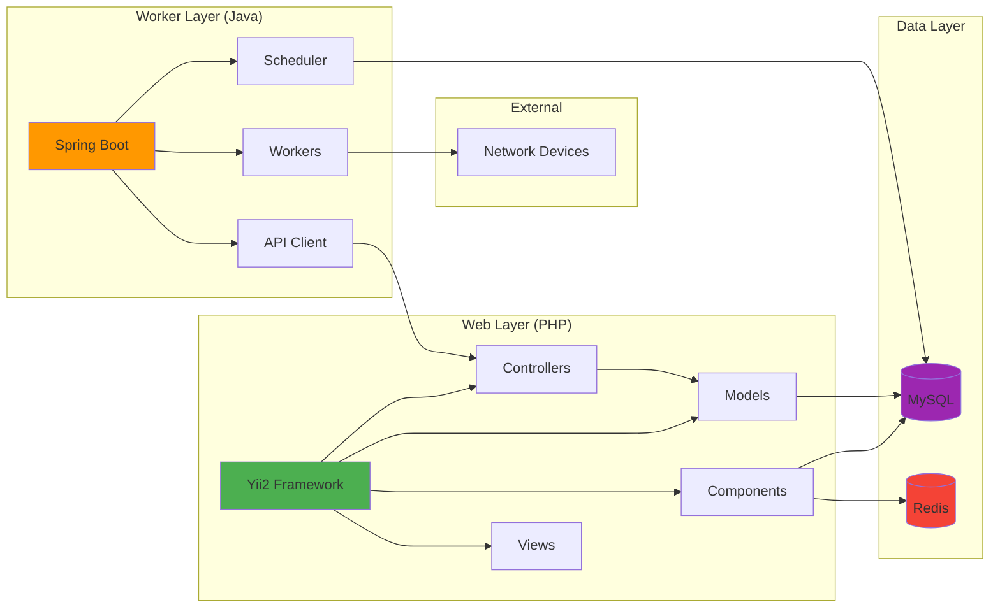
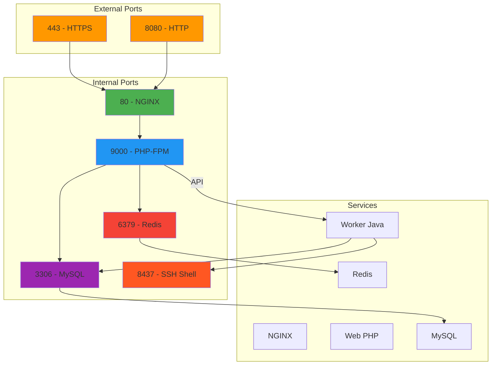
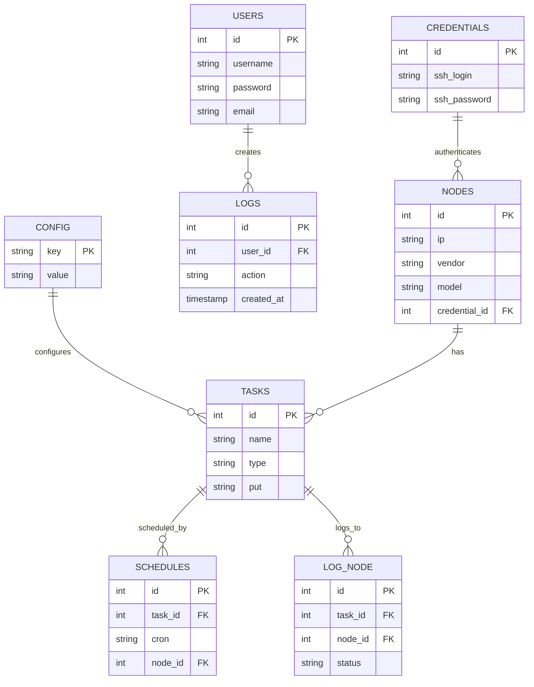
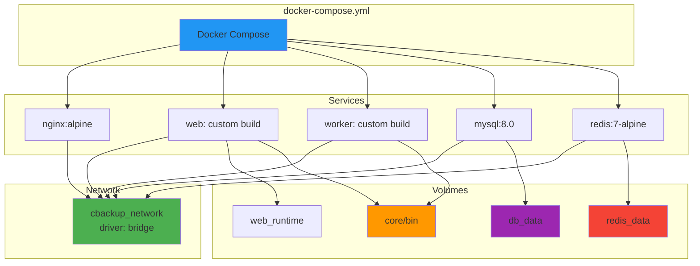

# 📊 Интерактивные диаграммы архитектуры cBackup

## 🔷 Логическая схема (Mermaid)

## 🌐 Сетевая схема (Mermaid)

## 🔄 Поток выполнения задачи бэкапа (Mermaid)

## 📊 Схема компонентов приложения (Mermaid)

## 🔌 Схема портов и подключений (Mermaid)

## 🗄️ Схема базы данных (Mermaid)

## 📦 Схема Docker Compose (Mermaid)

